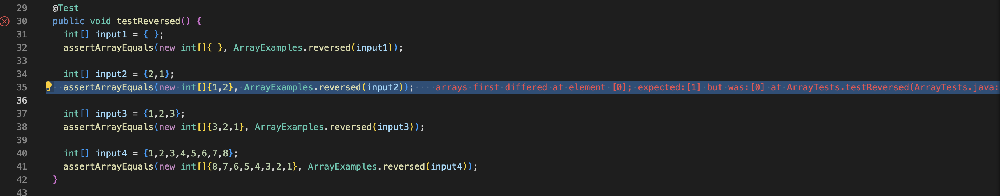
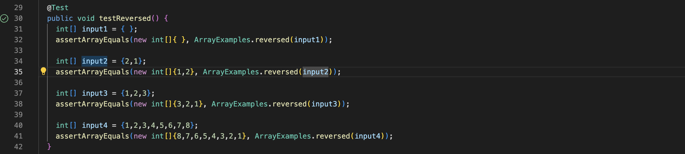

# Servers and Bugs

## Part 1 Web Server

The following code is an implementation of StringServer.

```
import java.io.IOException;
import java.net.URI;

  class Handler implements URLHandler {
    StringBuilder message = new StringBuilder("");

    public String handleRequest(URI uri) throws RuntimeException {
        if (uri.getPath().equals("/")) {
            return "Out content is none";
        } else {
            System.out.println("Path: " + uri.getPath());
            if (uri.getPath().contains("/add-message")) {
                String[] parameters = uri.getQuery().split("=");
                if (parameters[0].equals("s")) {
                    message.append(parameters[1]);
                    message.append("\n");
                }
                return message.toString();
            }
        }
        return "404 Not Found!";
    }
    
    public class StringServer{
        public static void main(String[] args) throws IOException{
            if(args.length == 0){
                System.out.println("missing port number");
                return;
            }
            int portNumber = Integer.parseInt(args[0]);
            Server.start(portNumber, new Handler());
            }
    }
}
```

In the compiler, we starts the WebServer by using the following code:
```
%javac StringServer.java
%java StringServer <Port Number>
```
then we could access the web server at the link:
`http://localhost:<Port Number>`


For this method called, the main method and the handleRequest in the Handler class are used. The URL output is http://localhost:1001/add-message?s=Love%20UCSD%20CSE%20and%20Chemistry (from handleRequest method) from the input of http://localhost:1001/add-message?s=Love%20UCSD%20CSE%20and%20Chemistry). The String array, parameters are created when splitting with "=" as {s, Love UCSD CSE and Chemistry}. Thus, parameter[0] is "s" and parameter[1] is "Love UCSD CSE and Chemistry", so the StringBuilder changed and the String "Love UCSD CSE and Chemistry" is appended which becomes "UCSD CSE and Chemistry".

then we we call the method the second time by using the add-message command again (http://localhost:1001/add-message?s=San). 

and results 


For the second method called, the main method and the handleRequest in the Handler class are used. the URL output remains http://localhost:1001/add-message?s=San (from handleRequest method) from the input. The String array, parameters are created when splitting with "=" as {s, San}. Thus parameter[0] is "s" and the parameter[1] is "San," so the StringBuilder changed and the String "San" is appended which becomes 
```
Love UCSD CSE and Chemistry (with a \n)
San (with a \n)
```

## Part 2 Bug

The bug in the method reversed
```
// Returns a *new* array with all the elements of the input array in reversed
  // order
  static int[] reversed(int[] arr) {
    int[] newArray = new int[arr.length];
    for(int i = 0; i < arr.length; i += 1) {
      arr[i] = newArray[arr.length - i - 1];
    }
    return arr;
  }
```

We can test the operation with the following Junit

```
@Test
  public void testReversed() {
    int[] input1 = { };
    assertArrayEquals(new int[]{ }, ArrayExamples.reversed(input1));

    int[] input2 = {2,1};
    assertArrayEquals(new int[]{1,2}, ArrayExamples.reversed(input2));

    int[] input3 = {1,2,3};
    assertArrayEquals(new int[]{3,2,1}, ArrayExamples.reversed(input3));

    int[] input4 = {1,2,3,4,5,6,7,8};
    assertArrayEquals(new int[]{8,7,6,5,4,3,2,1}, ArrayExamples.reversed(input4));
  }
  ```
  
  After running the test, we can find our reverse method failed the test.
  
  
  
  The expected value and the actual returned values are different. This might be cuased by a runtime error. 
  
  The current method is implemented as below:

```
  static int[] reversed(int[] arr) {
    int[] newArray = new int[arr.length];
    for(int i = 0; i < arr.length; i += 1) {
      arr[i] = newArray[arr.length - i - 1];
    }
    return arr;
  }
```

The problem of the loop is that, we are attempting to returns a *new* array with all the elements of the input array in reversed order, but inside the loop, the value of arr[i] is being assigned to newArray[arr.length - i - 1]. It should be the other way around.  

We can solve this bug by simply reversing the two arrays and return the new Array.

The coorect version of the reverse method is below:

```
  static int[] reversed(int[] arr) {
    int[] newArray = new int[arr.length]; 
    for(int i = 0; i < arr.length;i++) {
      newArray[i] = arr[arr.length - i - 1];
    }
    return newArray;
  }
```

Then, test the code with the same Junit Test above, now we pass the test.



# Part3 Reflection

During the second week's lab session, I gained fundamental knowledge on web servers and the fundamental concepts of URL and how to manipulate it. Prior to attending the lectures and lab sessions, I did not have any experience with starting a basic web server using Java programming language.
