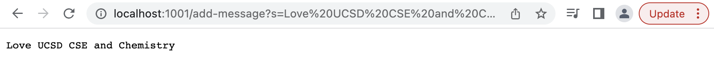
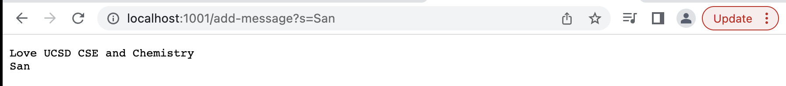

# Servers and Bugs

## Part 1 Web Server

The following code is an implementation of StringServer.

```
import java.io.IOException;
import java.net.URI;

  class Handler implements URLHandler {
    StringBuilder message = new StringBuilder("");

    public String handleRequest(URI uri) throws RuntimeException {
        if (uri.getPath().equals("/")) {
            return "Out content is none";
        } else {
            System.out.println("Path: " + uri.getPath());
            if (uri.getPath().contains("/add-message")) {
                String[] parameters = uri.getQuery().split("=");
                if (parameters[0].equals("s")) {
                    message.append(parameters[1]);
                    message.append("\n");
                }
                return message.toString();
            }
        }
        return "404 Not Found!";
    }
    
    public class StringServer{
        public static void main(String[] args) throws IOException{
            if(args.length == 0){
                System.out.println("missing port number");
                return;
            }
            int portNumber = Integer.parseInt(args[0]);
            Server.start(portNumber, new Handler());
            }
    }
}
```

In the compiler, we starts the WebServer by using the following code:
```
%javac StringServer.java
%java StringServer <Port Number>
```
then we could access the web server at the link:
`http://localhost:<Port Number>`



For this method called, the main method and the handleRequest in the Handler class are used. The URL output is http://localhost:1001/add-message?s=Love%20UCSD%20CSE%20and%20Chemistry (from handleRequest method) from the input of http://localhost:1001/add-message?s=Love%20UCSD%20CSE%20and%20Chemistry). The String array, parameters are created when splitting with "=" as {s, Love UCSD CSE and Chemistry}. Thus, parameter[0] is "s" and parameter[1] is "Love UCSD CSE and Chemistry", so the StringBuilder changed and the String "Love UCSD CSE and Chemistry" is appended which becomes "UCSD CSE and Chemistry".

then we we call the method the second time by using the add-message command again (http://localhost:1001/add-message?s=San). 

and results 



For the second method called, the main method and the handleRequest in the Handler class are used. the URL output remains http://localhost:1001/add-message?s=San (from handleRequest method) from the input. The String array, parameters are created when splitting with "=" as {s, San}. Thus parameter[0] is "s" and the parameter[1] is "San," so the StringBuilder changed and the String "San" is appended which becomes 
```
Love UCSD CSE and Chemistry (with a \n)
San (with a \n)
```
